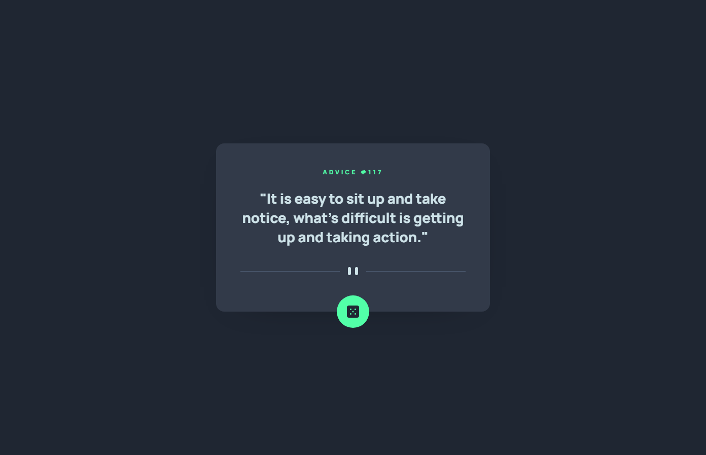

# Frontend Mentor - Advice generator app solution

This is a solution to the [Advice generator app challenge on Frontend Mentor](https://www.frontendmentor.io/challenges/advice-generator-app-QdUG-13db). Frontend Mentor challenges help you improve your coding skills by building realistic projects.

## Table of contents

- [Overview](#overview)
  - [The challenge](#the-challenge)
  - [Screenshot](#screenshot)
  - [Links](#links)
- [My process](#my-process)
  - [Built with](#built-with)
  - [What I learned](#what-i-learned)
  - [Continued development](#continued-development)
  - [Useful resources](#useful-resources)
- [Author](#author)

## Overview

### The challenge

Users should be able to:

- View the optimal layout for the app depending on their device's screen size
- See hover states for all interactive elements on the page
- Generate a new piece of advice by clicking the dice icon

### Screenshot



### Links

- HTML Solution URL: [HTML](https://github.com/JustANipple/advice-generator-app/blob/master/index.html)
- CSS Solution URL: [CSS](https://github.com/JustANipple/advice-generator-app/blob/master/styles/css/main.css)
- JS Solution URL: [JS](https://github.com/JustANipple/advice-generator-app/blob/master/script/script.js)
- Live Site URL: [LIVE](https://justanipple.github.io/advice-generator-app/)

## My process

### Built with

- Semantic HTML5 markup
- CSS custom properties
- Flexbox
- CSS Grid
- Mobile-first workflow
- API
- JavaScript
- SCSS

### What I learned

Getting a JSON from a third party API was quite challenging because i had never really made anything from scratch until now
I'm proud of the result and now it all feels more clear

```js
const url = "https://api.adviceslip.com/advice";
const request = new Request(url);
const response = await fetch(request);
const advice = await response.json();
```

### Continued development

Third-party-APIs are very interesting and makes it easier to add features on the website without making it on your own

### Useful resources

- [Advice Slip JSON API](https://api.adviceslip.com) - This helped me figuring out how to use the API

## Author

- Frontend Mentor - [@JustANipple](https://www.frontendmentor.io/profile/JustANipple)
